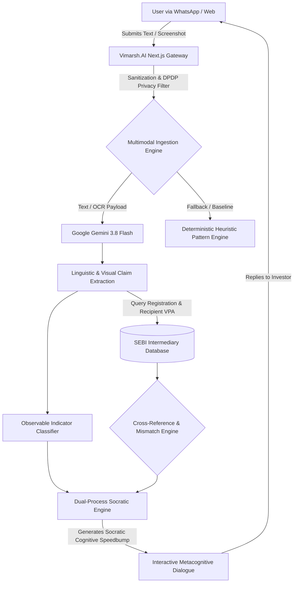

# Vimarsh.AI | The Socratic Fraud Shield
> **"Interrupting Fraud with Intelligent Deliberation."**
> **SANGYAN Investor Resilience Hackathon 2026** | IIT (BHU) Varanasi | Track A: Digital Fraud & Scam Resilience
> Organised by **SNTC, IIT (BHU) Varanasi** in collaboration with **SEBI** and **NSDL**.

---

## 🛡️ Executive Summary

Digitalization in India has democratized access to capital markets for millions of retail investors in Tier-2 and Tier-3 cities. However, this has been paralleled by an unprecedented surge in digital financial scams. According to the **Status of Policing in India Report (SPIR) 2026**, **72% of digital fraud victims recover none of their lost funds**, because reactive helplines (such as national helpline 1930 and CFCFRMS) only engage *after* defrauded funds traverse multiple Layer-1 and Layer-2 mule accounts.

Furthermore, traditional fraud detectors rely on static blocklists or binary *"Scam / Not Scam"* banners. These fail because sophisticated syndicates (such as "Sha Zhu Pan" / Pig Butchering and unregistered finfluencers) exploit **Dual-Process Cognitive Theory**: they engineer high-pressure FOMO environments on WhatsApp and Telegram that force victims into **System 1 (fast, emotional, impulsive)** processing. Warnings are dismissed due to confirmation bias.

**Vimarsh.AI (विमर्श)** solves this exact point of failure. It is the world's first investor-protection platform combining **Multimodal Vision-Language Models (VLMs)** with **Automated Socratic Questioning**. When a user encounters a suspicious investment message or screenshot, Vimarsh.AI acts as a cognitive speedbump, asking context-aware Socratic inquiries that guide the user back into **System 2 (analytical, deliberate)** reasoning before they authorize a payment.

---

## 👥 SANGYAN 2026 Team Details

| Member | Role | Institute | Qualifications | Contact / Profiles |
| :--- | :--- | :--- | :--- | :--- |
| **Daksh Khandelwal** | Team Leader | Indian Institute of Technology (IIT), Jodhpur | B.S. in Applied AI & Data Science | [GitHub](https://github.com/dk-khandelwal06) • [LinkedIn](https://www.linkedin.com/in/daksh-khandelwal-b02748391/) • [Email](mailto:dk.khandelwaliit@gmail.com) |
| **Khushi Kushwah** | Team Member | Indian Institute of Technology (IIT), Jodhpur | IIT Jodhpur Student | [GitHub](https://github.com/khushikushwah213) • [LinkedIn](https://www.linkedin.com/in/khushi-kushwah-94420b421/) • [Email](mailto:khushikushwah213@gmail.com) |

---

## ✨ Core Product Capabilities

1. **Multimodal Scam Ingestion**:
   - Analyzes raw text, forwarded WhatsApp messages, and Telegram investment calls.
   - Analyzes uploaded screenshots of fake trading applications, manipulated P&L statements, and forged certificates using **Gemini 3.8 Flash**.
2. **Automated Socratic Questioning (Signature Feature)**:
   - Formulates targeted, non-judgmental Socratic inquiries (e.g., *"Why would a SEBI-registered fund manager ask you to send money to an individual's personal UPI ID within 10 minutes?"*).
   - Features an **Interactive Metacognitive Dialogue Loop** where users can respond and deliberate.
3. **SEBI Intermediary Registry Cross-Referencing**:
   - Cross-references claimed registration numbers (`INA...`, `INH...`, `INZ...`) and entity names against a reference SEBI database.
   - Detects **Payment VPA Mismatches** (e.g., personal handles `@okhdfcbank`, `@paytm` vs authorized corporate escrow).
4. **Transparent Risk Assessment**:
   - Heuristic threat scoring (0–100) mapped to four qualified risk levels: `HIGH OBSERVED RISK`, `CAUTION ADVISED`, `LOW OBSERVED RISK`, `UNABLE TO ASSESS`.
   - Distinguishes observable indicators, rule matches, AI interpretation, and unverified claims.
5. **Ask Vimarsh (Conversational Safety Assistant)**:
   - Dedicated chatbot answering questions on Indian financial safety, SEBI circular PR No. 27/2025, BNS Section 318, and cyber helpline 1930.
6. **Bharat-First Multilingual Interface**:
   - Supports English, **हिन्दी (Hindi)**, and conversational **Hinglish**.
   - Includes a **WhatsApp Interceptor Simulator** demonstrating zero-installation accessibility for Tier-2/3 investors.
7. **Interactive Fraud Awareness Lab**:
   - 5 gamified micro-scenarios teaching users how to identify deceptive patterns before risking capital.
8. **Crisis Support (Emergency 1930)**:
   - Immediate Golden Hour action steps, direct portal links, and evidence preservation guidelines.
9. **Jury Evaluation Portal (`/demo`)**:
   - Pre-configured, 1-click synthetic evaluation scenarios with live pipeline telemetry for SANGYAN judges.

---

## 🏛️ System Architecture



---

## 🔒 Security, Privacy & Responsible AI

- **Digital Personal Data Protection (DPDP) Act 2023**: Zero-retention policy. Submitted media and texts are processed ephemerally in server RAM and are never permanently stored.
- **Strict Guardrail Compliance**: Vimarsh.AI **NEVER** provides stock tips, investment advice, price predictions, or product promotions.
- **Anti-Defamation Socratic Guardrail**: Rather than making unverified accusations against individuals, the system highlights observable inconsistencies and advises independent verification on `sebi.gov.in`.
- **Prompt Injection Defense**: User-supplied input is sanitized and isolated within strictly bounded instruction frames.

---

## 🚀 Quickstart & Local Setup

### Prerequisites
- Node.js >= 18 (Tested on v24.19.0)
- npm >= 9

### Installation
```bash
# Clone the repository
git clone https://github.com/dk-khandelwal06/vimarsh-ai.git
cd vimarsh-ai

# Install dependencies
npm install

# Configure environment variables
cp .env.example .env.local
# Add your Gemini API key in .env.local
```

### Running Locally
```bash
npm run dev
```
Open [http://localhost:3000](http://localhost:3000) in your browser.

### Production Build & Verification
```bash
npm run build
npm run start
```

---

## ☁️ Vercel Deployment Instructions

1. **Push to GitHub**:
   ```bash
   git add .
   git commit -m "feat: Vimarsh.AI Socratic Fraud Shield for SANGYAN 2026"
   git push origin main
   ```
2. **Import into Vercel**:
   - Visit [vercel.com/new](https://vercel.com/new).
   - Select your GitHub repository `vimarsh-ai`.
   - Framework Preset: **Next.js** (auto-detected).
3. **Set Environment Variables**:
   In the Vercel project settings, configure:
   - `GEMINI_API_KEY`: *(Your Google Gemini API Key)*
   - `GEMINI_MODEL`: `gemini-3.8-flash`
4. **Deploy**:
   - Click **Deploy**. Vercel will build the standalone Next.js App Router project and deploy in < 60 seconds.

See [VERCEL_DEPLOYMENT_GUIDE.md](./VERCEL_DEPLOYMENT_GUIDE.md) for full instructions.

---

## 📜 Statutory Disclaimers
*Vimarsh.AI is an independent research prototype developed for the SANGYAN 2026 Hackathon. It is not an official government service of SEBI, NSDL, or the Ministry of Home Affairs. For official financial fraud reporting, always call 1930 or visit cybercrime.gov.in.*
