<div align="center">

# 🛡️ Vimarsh.AI — The Socratic Fraud Shield

### *“Interrupting Fraud with Intelligent Deliberation.”*

An AI-assisted fraud-awareness prototype that helps people **understand** suspicious investment messages — and **think** before they act — instead of showing just another “safe / unsafe” banner.

<br>


<br>

**[▶️ Watch The Video](https://youtu.be/I9yJOF_yryM)** &nbsp;•&nbsp; **[🚀 Try the Prototype](https://vimarsh-ai-eight.vercel.app/)** &nbsp;•&nbsp; **[🎬 Pitch Deck](#-pitch-deck-gallery)** &nbsp;•&nbsp; **[🔧 Local Setup](#-installation--local-setup)** &nbsp;•&nbsp; **[👥 Team](#-team)**

</div>

---

## 📖 Overview

Digital financial fraud — fake investment tips, impersonation of regulated entities, manipulated profit screenshots and “guaranteed return” claims — spreads fast on messaging apps and works by creating urgency. A simple warning rarely explains *why* something is suspicious or *what to do next*.

**Vimarsh.AI** (*विमर्श*, “deliberation”) analyses a suspicious message or screenshot, highlights the observable warning signs, and then asks **Socratic questions** that nudge the user to reason it through and choose safer next steps.

It is an independent investor-protection and fraud-awareness **prototype** built for **SANGYAN Hackathon 2026 — Track A: Digital Fraud & Scam Resilience**.

---

## ✨ Key Features

<table>
<tr>
<td width="50%" valign="top">

🔍 **Text & Image Analysis**
Paste a suspicious message or upload a screenshot for AI-assisted analysis (Google Gemini), with a rule-based fallback.

❓ **Socratic Dialogue**
Context-aware questions plus an interactive reply loop that encourages critical thinking.

🚩 **Transparent Risk Indicators**
Observable warning signs, a risk level, and a separation of verified facts from unverified claims.

🏛️ **SEBI Reference Cross-Check**
Matches claimed registration numbers / entity names against a **small bundled reference dataset** and flags personal-UPI payment mismatches.

</td>
<td width="50%" valign="top">

💬 **Ask Vimarsh**
Conversational assistant for Indian financial-safety questions.

🌐 **English · हिन्दी · Hinglish**
Language selector across analysis, dialogue and chat.

🎮 **Scam Awareness Lab**
Three interactive fraud scenarios for practice.

🆘 **Emergency Support (1930)**
Reporting steps, evidence-preservation tips and official portal links.

📱 **WhatsApp Simulator & Jury Demo**
A simulated WhatsApp-style experience and one-click demo scenarios at `/demo`.

</td>
</tr>
</table>

---

## 🔄 How It Works

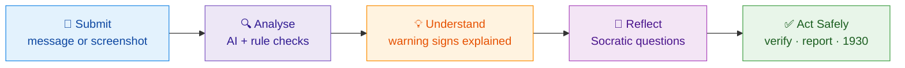

---

## 🏛️ System Architecture

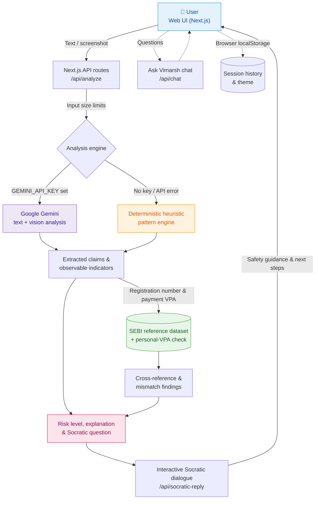

---

## 🧰 Technology Stack

| Layer | Technologies |
|:--|:--|
| **Frontend** | Next.js 14 (App Router), React 18, TypeScript |
| **Styling & UI** | Tailwind CSS, Framer Motion, Lucide React, canvas-confetti |
| **Backend & API** | Next.js API routes (`/api/analyze`, `/api/socratic-reply`, `/api/chat`, `/api/verify-sebi`) |
| **AI / Analysis** | Google Gemini API (default model `gemini-3.8-flash`, configurable), rule-based heuristic fallback |
| **Data / Verification** | Bundled SEBI reference dataset (10 sample entities), registration-number and personal-UPI matcher, demo and awareness scenario data |
| **Deployment** | Vercel |

---

## 🎬 Pitch Deck Gallery

<table>
<tr>
<td width="50%" valign="top">

**1️⃣ Introduction**

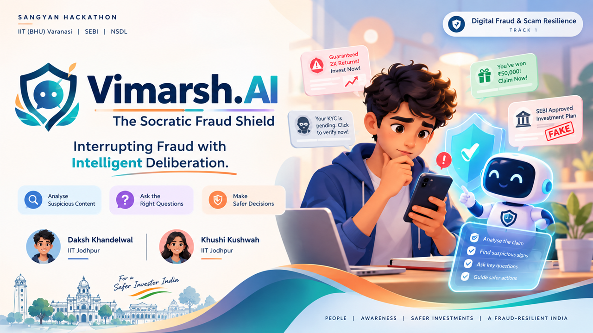

Introducing Vimarsh.AI, its purpose, and the team behind the project.

</td>
<td width="50%" valign="top">

**2️⃣ The Problem**

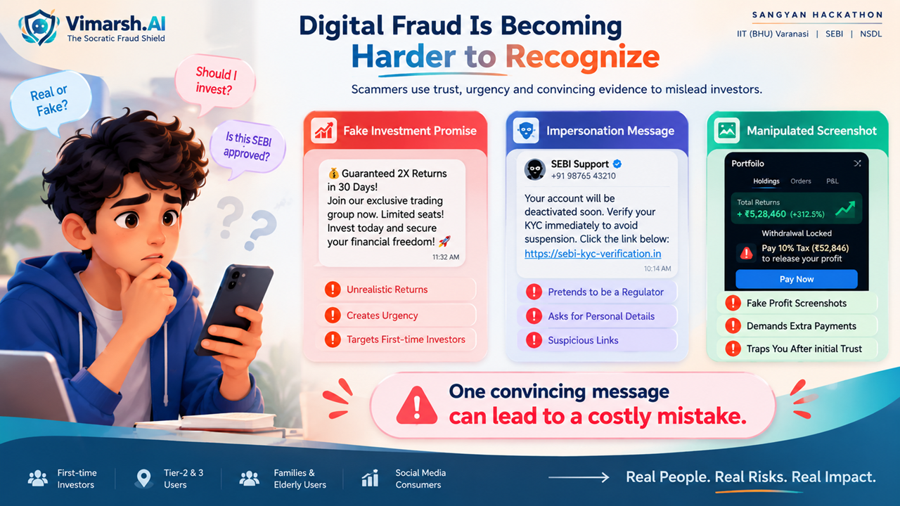

Why digital fraud and deceptive investment messages can be difficult to recognize.

</td>
</tr>
<tr>
<td width="50%" valign="top">

**3️⃣ The Gap**

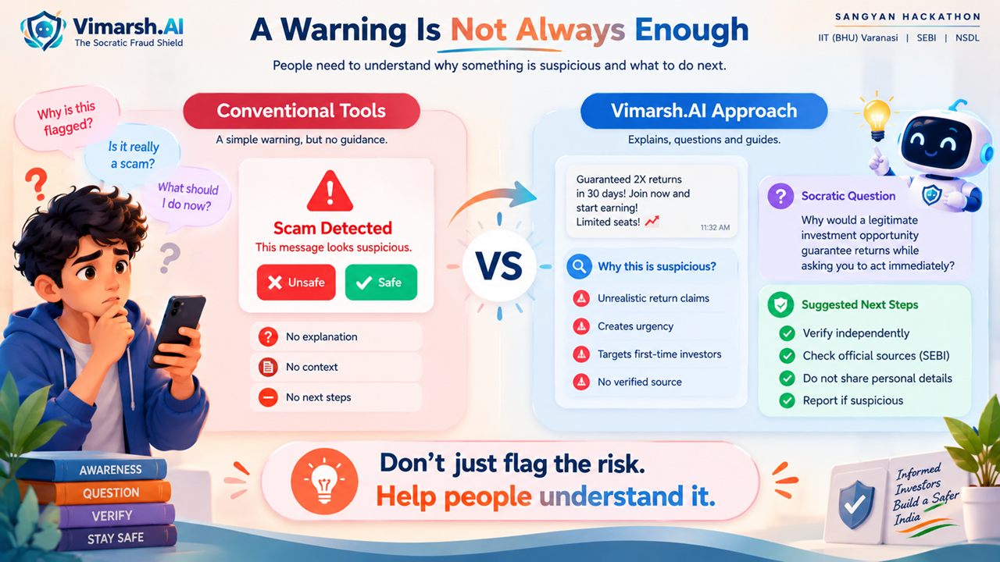

Why simple warnings alone may not help users understand or evaluate suspicious content.

</td>
<td width="50%" valign="top">

**4️⃣ Our Solution**

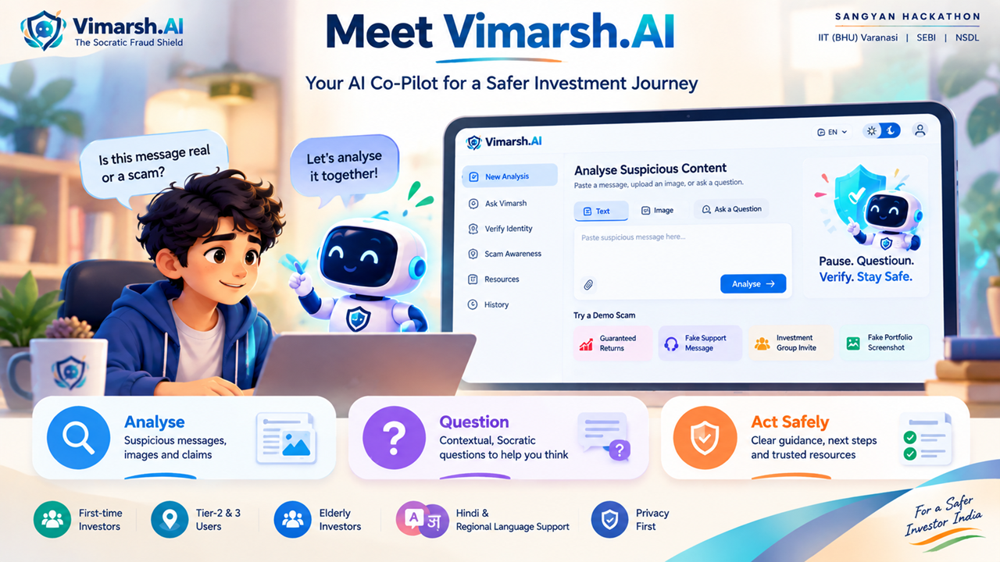

Introducing Vimarsh.AI as an AI-assisted digital fraud awareness platform.

</td>
</tr>
<tr>
<td width="50%" valign="top">

**5️⃣ Unique USP**

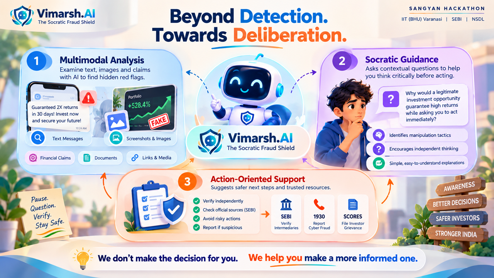

Multimodal analysis, Socratic guidance, and actionable safety information.

</td>
<td width="50%" valign="top">

**6️⃣ How It Works**

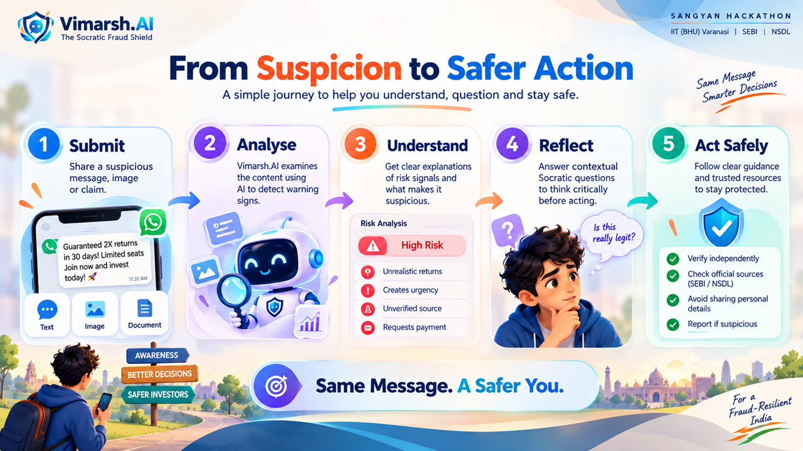

The journey from submitting suspicious content to considering safer next steps.

</td>
</tr>
<tr>
<td width="50%" valign="top">

**7️⃣ Live Prototype Demo**

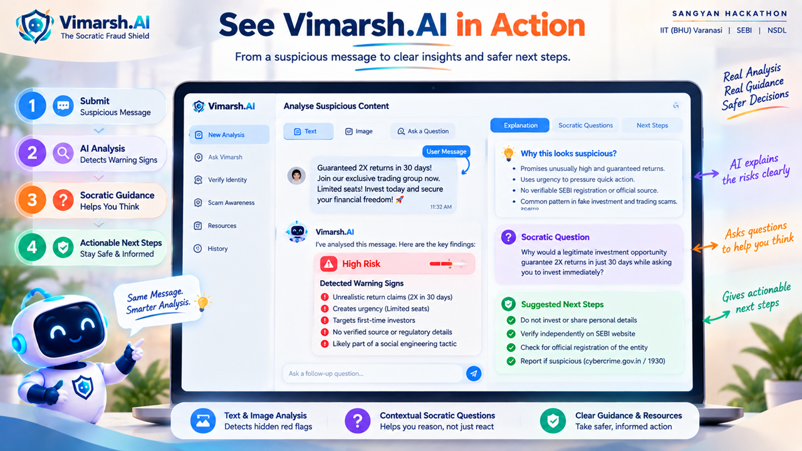

A visual walkthrough of the Vimarsh.AI prototype and its analysis experience.

</td>
<td width="50%" valign="top">

**8️⃣ Technology & Access**

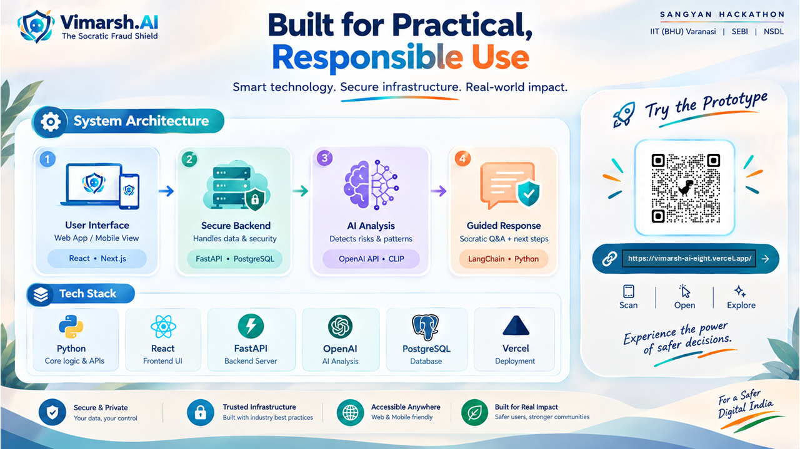

The system architecture, technical foundation, and prototype access information.

</td>
</tr>
<tr>
<td width="50%" valign="top">

**9️⃣ Impact & Vision**

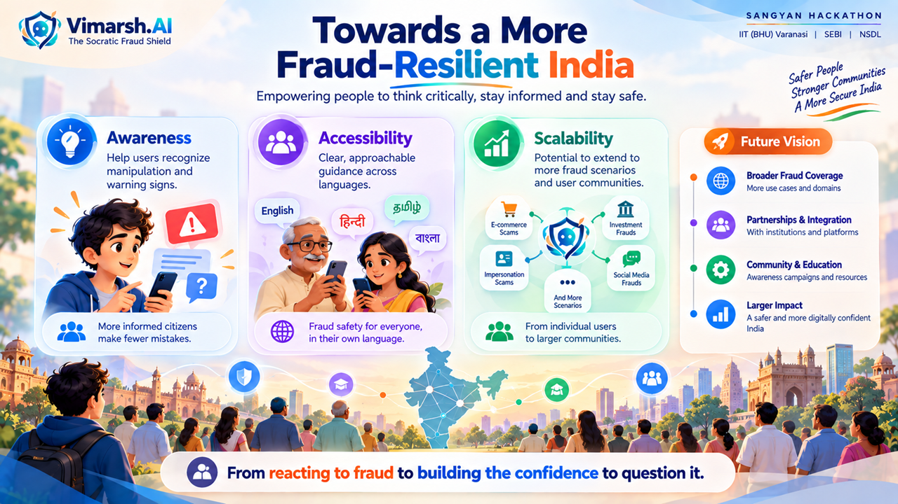

Awareness, accessibility, scalability, and the vision for a more fraud-resilient India.

</td>
<td width="50%" valign="top">

**🔟 Thank You**

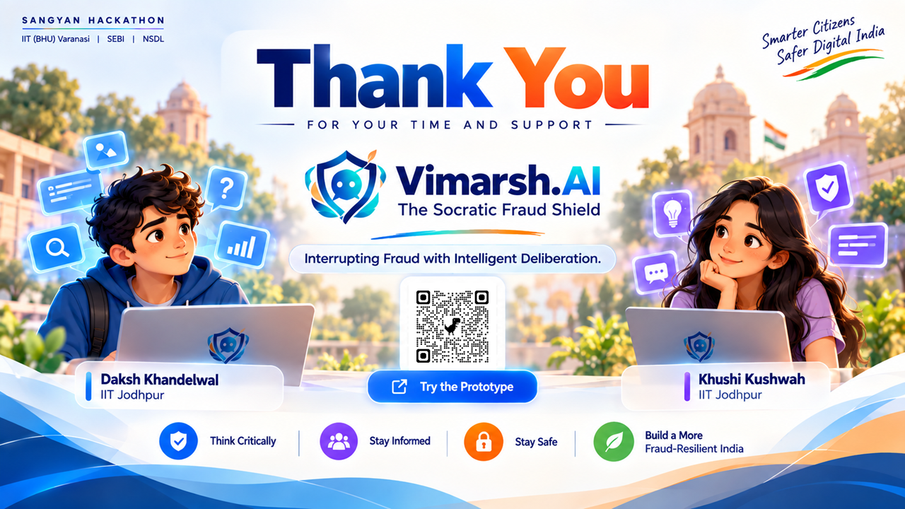

Closing message and acknowledgement of the project team.

</td>
</tr>
</table>

> 📝 *Slide 8 is a presentation-level overview; the stack actually implemented in this repository is listed under [Technology Stack](#-technology-stack).*

---

## 🚀 Try the Prototype

<div align="center">

### 👉 **[vimarsh-ai-eight.vercel.app](https://vimarsh-ai-eight.vercel.app/)** 👈

*Judges can open `/demo` for one-click demo scenarios.*

<sub>This is a hackathon prototype; availability depends on its deployment status.</sub>

</div>

---

## 🔧 Installation & Local Setup

**Prerequisites:** Node.js 18+ and npm.

```bash
# 1. Clone the repository
git clone https://github.com/dk-khandelwal06/vimarsh-ai.git
cd vimarsh-ai

# 2. Install dependencies
npm install

# 3. Create your local environment file
cp .env.example .env.local
# then add your own Gemini API key in .env.local

# 4. Start the development server
npm run dev
```

Open **http://localhost:3000** in your browser.

**Environment variables** (see `.env.example`):

| Variable | Purpose |
|:--|:--|
| `GEMINI_API_KEY` | Enables live Gemini analysis and chat. Without it, the app uses the built-in heuristic fallback. |
| `GEMINI_MODEL` | Gemini model name (defaults to `gemini-3.8-flash`). |
| `NEXT_PUBLIC_APP_NAME`, `NEXT_PUBLIC_APP_TAGLINE`, `NEXT_PUBLIC_HACKATHON_TRACK` | Display metadata. |
| `SARVAM_API_KEY`, `HUGGINGFACE_API_TOKEN` | Optional placeholders in `.env.example`; not used by the current code. |

> 🔐 Never commit `.env.local` or real API keys.

---

## 📁 Repository Structure

```text
.
├── src/
│   ├── app/            # Pages (home, dashboard, demo, onboarding) and API routes
│   ├── components/     # UI: Socratic shield, chatbot, awareness lab, emergency support…
│   ├── lib/            # Gemini integration, heuristic analyzer, SEBI matcher, storage helpers
│   ├── data/           # SEBI reference dataset, demo & awareness scenarios, team data
│   └── types/          # Shared TypeScript types
├── public/             # Static assets
├── assets/             # 10 pitch-deck slide images (slide 1.png … slide 10.png)
├── tests/              # verify-system.mjs verification script
├── .env.example        # Example environment variable names
├── package.json        # Dependencies and scripts
└── README.md
```

---

## 👥 Team

<div align="center">

<table>
<tr>
<td align="center" width="50%" valign="top">

### Daksh Khandelwal
**Team Leader**

Indian Institute of Technology (IIT) Jodhpur
B.S. in Applied AI & Data Science

📧 [Email](mailto:dk.khandelwaliitj@gmail.com) &nbsp;•&nbsp; 🐙 [GitHub](https://github.com/dk-khandelwal06) &nbsp;•&nbsp; 💼 [LinkedIn](https://www.linkedin.com/in/daksh-khandelwal-b02748391/)

</td>
<td align="center" width="50%" valign="top">

### Khushi Kushwah
**Team Member**

Indian Institute of Technology (IIT) Jodhpur

📧 [Email](mailto:khushikushwah213@gmail.com) &nbsp;•&nbsp; 🐙 [GitHub](https://github.com/khushikushwah213) &nbsp;•&nbsp; 💼 [LinkedIn](https://www.linkedin.com/in/khushi-kushwah-94420b421/)

</td>
</tr>
</table>

</div>

---

## ⚖️ Responsible Use & Disclaimer

> **Vimarsh.AI is an independent research prototype developed for SANGYAN Hackathon 2026.** It is **not** an official service of SEBI, NSDL, or any government authority.
>
> - It does **not** provide stock tips, investment advice, price predictions, or investment product promotions.
> - The SEBI cross-check uses a small bundled **reference dataset**, not a live SEBI registry. A matching registration number does not prove a message is genuine.
> - AI output can be incomplete or wrong. Always verify suspicious claims independently on official channels such as [sebi.gov.in](https://www.sebi.gov.in).
> - To report financial cyber fraud, call **1930** or visit [cybercrime.gov.in](https://cybercrime.gov.in).

---

<div align="center">

### 🛡️ Vimarsh.AI — The Socratic Fraud Shield
*Interrupting Fraud with Intelligent Deliberation.*

Built to encourage critical thinking and safer digital decisions.

</div>
